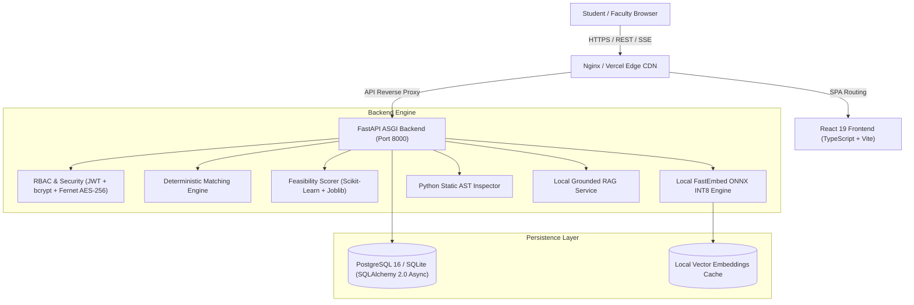

# Meridian — AI Final-Year Project Mentor & Engineering Architect

<div align="center">

[](https://fastapi.tiangolo.com)
[](https://react.dev)
[](https://www.typescriptlang.org)
[](https://www.postgresql.org)
[](https://github.com/qdrant/fastembed)
[](https://tailwindcss.com)
[](LICENSE)
[](tests/)

**Transforming final-year engineering anxiety into an end-to-end validated architecture, sprint-by-sprint roadmap, persistent AI mentor, and viva-ready defense.**

[Explore Live Demo](#-live-deployment) • [Key Capabilities](#-key-capabilities) • [Architecture](#-system-architecture) • [Quick Start](#-quick-start) • [API Reference](#-api-endpoints)

</div>

---

## 🎯 The Problem Meridian Solves

Final-year engineering and computer science students universally struggle with the same critical questions:
- *"I know Python and React, but what project should I actually build?"*
- *"Is this idea already a clichéd duplicate that examiners reject?"*
- *"How do I divide the architecture into concrete modules and design the database?"*
- *"What specific deliverables should my team finish in Week 1?"*
- *"How do I prepare for grueling viva voce questions and technical examiner traps?"*

**Meridian is not just an idea generator — it is an end-to-end AI Final-Year Project Mentor.** It guides students through the complete engineering journey: from self-assessed skill gap analysis and deterministic project discovery to relational schema blueprints, week-by-week implementation tracking, and viva defense coaching.

---

## 🌟 Key Capabilities

### 1. 🎓 Student Skill Profiling & AI Skill Profile Card
- **Structured Academic Persona**: Captures education level (`B.Tech`, `BCA`, `MCA`, `M.Tech`), academic year (`1st` to `4th Final Year`), primary project goal (`College Capstone`, `Placement Showcase`, `Hackathon Winner`, `Startup MVP`, `Research Publication`), and project preferences.
- **Dynamic AI Student Skill Profile Card**: Real-time synthesis of:
  - **Technical Persona**: Evaluates degree, interests, and declared skills.
  - **Confirmed Strengths**: Automatically highlights verified core proficiencies.
  - **Identified Gaps**: Flags missing prerequisites (e.g. Docker containerization, asynchronous messaging, edge quantization).
  - **Recommended Tech Stack**: Synthesizes the optimal toolchain tailored to the student's hardware constraints.

### 2. 🌐 3D Topological Idea Discovery Graph
- **FastEmbed ONNX INT8 Local Vector Space**: Semantic clustering using local INT8 quantized embeddings (`BAAI/bge-small-en-v1.5`) without external API latency.
- **3D Force-Directed Graph**: Visualizes similarity and prerequisites across 100+ vetted engineering capstones.
- **Topological Traversal**: NetworkX DAG dependency parsing to enforce prerequisite paths.
- **Dual Presentation**: Simple mode with plain-English category filters and technical mode showing graph metrics.

### 3. 📊 7-Parameter Scoring Engine & Explainable Recommendation
Every candidate project is evaluated against 7 deterministic metrics:
1. **Student Skill Match %**: Direct coverage of declared proficiencies.
2. **Innovation & Uniqueness %**: Cosine distance from common duplicate submissions.
3. **Real-World Impact %**: Industry significance (Healthcare, FinTech, Agriculture, Public Welfare).
4. **Technical Difficulty %**: Algorithmic complexity and architectural depth.
5. **Resume & Placement Value %**: Alignment with active engineering job requirements.
6. **Implementation Feasibility %**: Calibrated for team size, semester weeks, and CPU/GPU hardware.
7. **Research & Paper Potential %**: Peer-reviewed publication and citation viability.

> **Explainable "Why Recommended" Box**: Provides transparent, plain-English rationales breaking down why an idea is tailored to the student's exact background.

### 4. 🛠 Project Studio: Week 1 Quick-Start & Relational Schema
Once a project is adopted, Project Studio provides actionable engineering blueprints:
- **"What to Do in Week 1" (Day 1–7 Action Plan)**: Actionable daily roadmap covering toolchain setup, entity modeling, and the first working end-to-end API smoke test.
- **Relational Database Schema & ERD Blueprint**: Entity tables (`users`, `project_records`, `inferences_and_logs`) with copyable SQL DDL ready for PostgreSQL or SQLite.
- **4-Module System Architecture**: Modular division separating Data Ingestion, Inference Core, ASGI API Services, and Client Dashboard.

### 5. 🤖 Persistent AI Technical Mentor with Real AST Viva Defense
- **Interactive Technical Mentor**: Grounded in academic papers via local RAG; coaches students through blockers.
- **Static AST Code Inspector**: Analyzes uploaded Python source files using Python's native `ast` module to detect recursion limits, concurrency bottlenecks, and unindexed database queries.
- **Viva Voce Defense Engine**: Generates architectural defense questions with examiner justifications and model answers.

### 6. 🏛 Faculty Oversight & Cohort Analytics
- **Duplicate Cluster Detection**: Automatically identifies teams submitting identical ideas across the department using cosine similarity thresholding.
- **Difficulty Balancing**: Visualizes distribution of beginner, intermediate, and advanced projects across cohorts.
- **GitHub Drift Tracking**: Flags when teams stray from their approved proposal or fall behind sprint schedules.

### 7. 🌗 Dual-View UX: Simple Mode vs Technical Details
- **Simple Mode (Default)**: Clean, plain-language headings and actionable step-by-step guidance for first-time students.
- **Technical Mode**: One-click toggle revealing mathematical score formulas, FastEmbed ONNX INT8 specs, AST tree metrics, and DAG traversal logs.

---

## 🏛 System Architecture

Meridian strictly separates **deterministic computation** from **language generation**:
- **All scoring, matching, vector distance, feasibility analysis, and graph traversals are computed by deterministic backend Python code.**
- The LLM is used **only** for natural language phrasing, mentor dialogue, and plain-English explanations.



---

## 🚀 Quick Start & Running Locally

### Prerequisites
- **Python:** 3.12+ (or 3.14)
- **Node.js:** 20+
- **Git**

### 1. Clone the Repository
```bash
git clone https://github.com/harshchavan009/AI-Project-Generator.git
cd AI-Project-Generator
```

### 2. Automated One-Command Startup
```bash
chmod +x start.sh
./start.sh
```
This automatically initializes the Python virtual environment, installs frontend/backend dependencies, sets up the database, and launches both services.

---

### Manual Startup

#### Backend Setup
```bash
# Create and activate virtual environment
python3 -m venv .venv
source .venv/bin/activate

# Install production dependencies
pip install -r requirements.txt

# Start FastAPI development server
PYTHONPATH=. uvicorn backend.main:app --host 127.0.0.1 --port 8000 --reload
```
API Documentation: **`http://127.0.0.1:8000/docs`**  
Health Endpoint: **`http://127.0.0.1:8000/health`**

#### Frontend Setup
```bash
cd frontend
npm install
npm run dev
```
Client Application: **`http://localhost:5173`**

---

## 🌐 Live Deployment

Meridian is configured for production deployment across modern cloud platforms:

### Option A: 1-Click Deployment via Render Blueprint (Recommended)
The repository includes a pre-configured [`render.yaml`](render.yaml) blueprint:
1. Log in to **[Render.com](https://dashboard.render.com)**.
2. Click **New +** → **Blueprint**.
3. Select this repository: `harshchavan009/AI-Project-Generator`.
4. Render will provision the **PostgreSQL Database**, **FastAPI Backend**, and **React Static Frontend** automatically.

### Option B: Split Deploy (Vercel Frontend + Render Backend)
- **Frontend (Vercel)**:
  - Root Directory: `frontend`
  - Framework: `Vite`
  - Environment Variable: `VITE_API_URL=https://your-backend.onrender.com`
- **Backend (Render)**:
  - Root Directory: *(leave blank / `.`) *
  - Build Command: `pip install -r requirements.txt`
  - Start Command: `uvicorn backend.main:app --host 0.0.0.0 --port $PORT`

> For complete step-by-step instructions and troubleshooting, see **[`DEPLOYMENT.md`](DEPLOYMENT.md)**.

### Option C: Docker Compose (VPS / Single Host)
```bash
docker compose up -d --build
```
Spins up PostgreSQL (`5432`), FastAPI (`8000`), and Nginx React (`80`/`5173`) with health checks and persistent volumes.

---

## 📡 Core API Endpoints

| Method | Endpoint | Description | Auth Required |
| :--- | :--- | :--- | :---: |
| `GET` | `/` | Root service identification & probe | No |
| `GET` | `/health` | Production DB, model & reachability status | No |
| `POST` | `/api/auth/register` | Register student, faculty, or admin account | No |
| `POST` | `/api/auth/login` | Authenticate and obtain JWT Bearer token | No |
| `GET` | `/api/taxonomy` | Fetch standardized engineering skill taxonomy | No |
| `POST` | `/api/match` | Deterministic 7-parameter idea matching | Optional |
| `POST` | `/mentor/chat` | Server-Sent Events (SSE) AI Mentor stream | Optional |
| `POST` | `/api/ast/viva` | Static AST Python inspector & viva generator | Optional |
| `GET` | `/api/tasks/{project_id}` | Retrieve sprint task board and drift status | Optional |
| `GET` | `/api/cohort/duplicates` | Faculty cohort cross-similarity cluster detection | Faculty/Admin |
| `GET` | `/api/cohort/difficulty-distribution` | Faculty cohort complexity distribution metrics | Faculty/Admin |

---

## 🔒 Security & Academic Compliance

- **Role-Based Access Control (RBAC)**: Enforces least-privilege access across `student`, `faculty`, and `admin` roles via JWT Bearer tokens.
- **FERPA & GDPR Compliance**: Student PII is encrypted at rest using AES-256 (Fernet). Automated cascading deletion endpoints support academic privacy compliance.
- **Rate Limiting & Abuse Prevention**: SlowAPI limits excessive requests. Server-side input sanitization neutralizes XSS, SQL injection, and prompt-injection attacks.

---

## 🧪 Testing & Verification

The test suite validates deterministic scoring, novelty calculations, and auth workflows:
```bash
PYTHONPATH=. .venv/bin/pytest tests/
```
```
======================= 23 passed, 20 warnings in 8.93s ========================
```
- `tests/test_advanced_features.py`: Task board CRUD, drift detection, and RAG guardrails.
- `tests/test_api_integration.py`: JWT authentication, role protection, and mentor endpoints.
- `tests/test_feasibility_unit.py`: Deterministic mathematical feasibility scoring logic.
- `tests/test_matching_unit.py`: Skill-coverage matrix calculations.
- `tests/test_novelty_unit.py`: Local vector space uniqueness checks.

---

## 📜 License

This project is licensed under the **MIT License** — see the [LICENSE](LICENSE) file for details.
